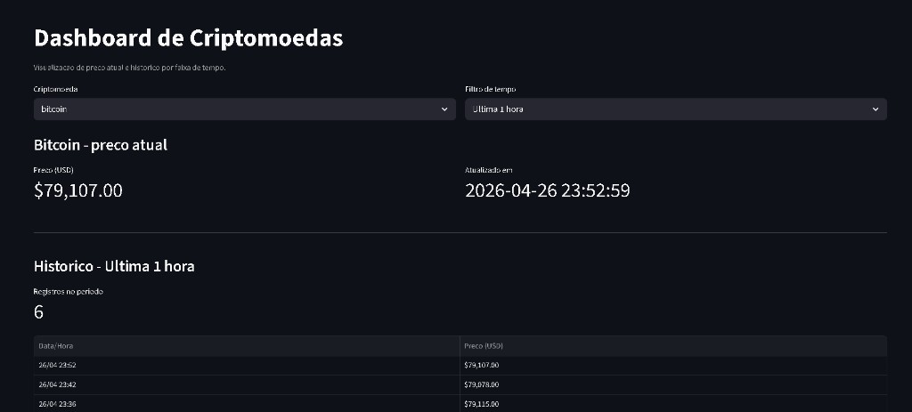

# Crypto Price Tracker Dashboard

## Visão Geral

Este projeto coleta automaticamente os preços de 5 criptomoedas pré-definidas em intervalos de 10 minutos utilizando a API pública da CoinGecko.

Os dados são armazenados localmente em JSON e exibidos em um dashboard interativo desenvolvido com Streamlit.

O usuário pode visualizar o preço atual de cada moeda e consultar o histórico por faixa de tempo.

---

## Screenshots

### Dashboard principal + historico por periodo



---

## Funcionalidades

- Monitoramento de 5 criptomoedas
- Atualização automática a cada 10 minutos
- Exibição do preço atual
- Horário da última atualização
- Histórico em tabela
- Filtros de tempo:
  - Última 1 hora
  - Entre 1 e 6 horas
  - Entre 6 e 24 horas
- Quantidade de registros encontrados

---

## Coleta e Armazenamento

Cada novo preço coletado é salvo em um arquivo JSON local.

O sistema mantém somente os registros das últimas 24 horas, removendo automaticamente dados antigos para evitar crescimento desnecessário do arquivo.

---

## Tecnologias Utilizadas

- Python
- FastAPI
- Streamlit
- JSON
- CoinGecko API

---

## Como Executar Localmente

Clone o repositório:

```bash
git clone <url-do-repositorio>
cd <nome-do-repositorio>